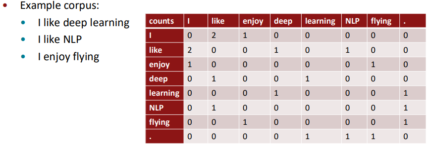
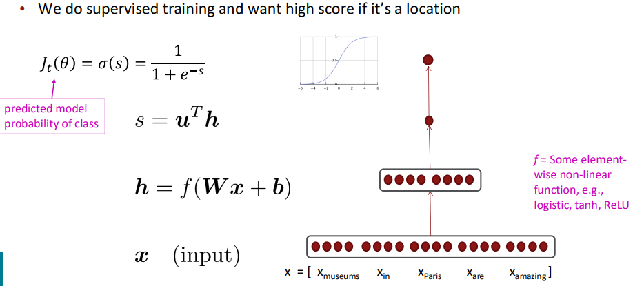

# week1: 词向量

## 1 词意表达

如何表达一个单词的意思是一个关键的问题，对于人类一棵树可能是记忆中抽象的画面，但对于计算机，应该如何来表示抽象的树？

1. WordNet

   这是早些时期NLP对词意的一个一般性的解决方案，它通过将该词和它的同义词（synonym sets）/上位词（hypernyms）连接成为一个网络，从而让计算机理解该词的意义所在。这种解决方案的问题在于：

   - 无法在特定上下文中对两个相近词汇进行有效区分，也即无法确定两个同义词的细微差别；
   - 无法随着语言的发展及时更新，这在网络流行词汇对语言的整体影响逐渐变强的今天是稍显落后的；
   - 同义/上位词的更新充满主观性，依赖于特定人员的主动更新；

2. one-hot

   这是传统NLP的做法之一，将不同词汇设置为离散的bit，这样做的缺点显而易见：

   - 词表量可能会非常大（500000+），那么要想表达所有的词汇就需要这么长的向量来表示，也就是最少需要500000bit/8=62,500byte来表示一个词汇，成本过于高昂；
   - 两个词向量一定是在空间上正交的，那么任意两个可能在语意上接近的词汇在one-hot编码上都显现出毫不相关的特性，这是不合理的；

3. Distributional semantics（分布语意）

   这可能是NLP最成功的语意表达方式，它通过上下文来了解词汇的真正含义，认为一个词汇的语意是由它的上下文来决定的。这里也将词汇表达为计算机中的向量，不过不再是one-hot中的稀疏向量了，而是稠密向量，词与词之间的相似度由两者之间的点积来表示。

## 2 词到向量（Word2vec）

### 2.1 基本概念

这一步是一个学习的过程，而非像WordNet中那样，由人类来主观指定。学习的过程从初始状态指定的各个词向量向着最大似然的方向逼近：
$$
L(\theta)=\prod_{t=1}^T\prod_{-m{\le}j{\le}m,\,j\ne0}P(w_{t+1}|w_t;\theta)\\
J(\theta)=-\frac{1}{T}logL(\theta) \label{1.2.1} \tag{1.2.1}
$$
其中，$m$表示窗口长度，是一个固定值，$\theta$表示所有的待优化参数，$t$表示当前词所在的位置索引，$T$表示当前训练的输入语句，$L$函数为最大似然函数，$J$函数表示优化的目标函数，学习的过程也是$J$函数极小化的过程。

比较有趣的是，这里使用了两个向量来表示词$w$：
$$
v_w\; when \; w \; is \; a \; center \; word \\
u_w\; when \; w \; is \; a \; centext \; word
$$
那么对于一个center word $c$和context word $o$来说，$P$函数的计算公式为：
$$
P(o|c)=\frac{exp(u_o^Tv_c)}{\sum_{w{\in}V}exp(u_w^Tv_c)}  \label{1.2.2} \tag{1.2.2}
$$
这里相当于做了一个类似与$softmax$的求权操作，$exp$指数操作保证了非负性，而大V对应的是词表范围的的归一化。

有了$P$、$L$、$J$函数，接着通过极小化$J$函数，我们便可以从初始的$θ$不断迭代，拿到我们想要的最终的$θ$。我们期望的$θ$应该是包含了词表内所有单词向量$v$、$u$的一个大矩阵，维度应该是：[vocabulary size, feature size]。上述迭代过程假如用梯度下降可以表达为：
$$
{\theta}^{new}={\theta}^{old}-\alpha\nabla_{\theta}J(\theta) \label{1.2.3} \tag{1.2.3}
$$
其中$\alpha$就是我们所熟知的学习率，决定着梯度下降的步长。回顾上述$J$函数的表达式可以发现，$J$函数的计算代价是非常昂贵的，它需要计算所有的$P$（$T*2m$次$P$函数的计算），会随着语料库的变大而变得代价无法接受。针对上述梯度下降过高的计算成本，可以通过小批量梯度下降来进行优化：对所有语料进行采样，对每个采样窗口内的语料分别进行梯度下降。

### 2.2 主要模型

#### 2.2.1 Skip-grams(SG)模型

式$\ref{1.2.2}$的计算成本是很高的，所以一般SG模型都会进行负采样（negative sampling）。仔细观察式$\ref{1.2.2}$的分母部分，可以看出，非center周边窗口部分的词$u_w$全部都与$v_c$进行了内积计算，这正是计算成本过高的原因。因此为了减少窗口外词向量内积计算，改变计算形式如下：
$$
J_{neg-sample}(u_o,v_c,U)=-log \sigma (u_o^T v_c) - \sum _ {k\in\{K \; sampled \; indices\}} log \sigma (-u_k^T v_c) \label{1.2.4} \tag{1.2.4}
$$
这里，用$sigmoid$计算代替了softmax计算，式$\ref{1.2.4}$右侧第二项即是负采样项。
$$
\sigma(x) = \frac {1} {1+e^{-x}} \label{1.2.5} \tag{1.2.5}
$$
而$k$的采样遵循$unigram \;distribution$概率分布：
$$
P(w)=\frac {U(w)^{3/4}} {Z} \label{1.2.6} \tag{1.2.6}
$$

#### 2.2.2 Continuous Bag of Words (CBOW)模型

这里未做介绍。

### 2.3 共现矩阵（co-occurrence matrix）

可以想见，式$\ref{1.2.4}$的计算矩阵是相当稀疏的，在矩阵更新时要尽可能的避免全量更新（因为其稀疏特征）。这里可以采用基于窗口的共现矩阵来进行局部更新：

而在训练时保留这样一个稀疏矩阵是非常占空间的，可以采用SVD分解来进行矩阵压缩：

然而对上图中的原始计数（raw counts）直接进行SVD分解效果并不理想，有如下几个尝试：

- 功能性词汇（function words）例如：the，he，has等等出现频率过高，可能会带来超出预期的影响
  - 对原始计数取log
  - 对原始计数设置最大值
  - 直接忽略功能性词汇
- 设置渐进性的窗口，例如离中心词更近的词有更多的影响
- 可以用相关系数来代替原始计数，对负采样单词的相关系数设置为0

### 2.4 如何评估词向量

一般NLP的评估方法分为两种：内在评估（Intrinsic）和外在评估（extrinsic）

- 内在评估（Intrinsic）
  - 基于特定的子任务评估，不依赖下游的任务（如文本分类、机器翻译、问答系统等）
  - 计算较快
  - 易于帮助理解整个系统
  - 如果与真实任务之间的关系未被建立的话，无法确认这种评估方式是否是有用的
- 外在评估（extrinsic）
  - 基于真实任务进行评估
  - 计算较慢，评估耗时较久
  - 如果评估结果较差的话，无法确认其中哪个子模块子系统出了问题
  - 如果替换了某个子系统之后提升了评估的准确度，那么就说明整个系统得到了优化

#### 2.4.1 内在评估（Intrinsic）

1. 类比推理任务（Word Analogy）：测试词向量是否能捕捉线性关系，**king - man + woman ≈ queen**。缺点是如果词对之间的关系非线性明显，上述办法无法评估
2. 词相似度任务（Word Similarity / Relatedness）：通过余弦相似度来计算两个词之间的相似程度，并与人类标注的词对相似程度进行对比打分
3. 词类比聚类 / 语义一致性（Clustering / Semantic Coherence）：分析相似词是否在向量空间中聚集在一起（如动物、国家、动词等）

#### 2.4.2 外在评估（extrinsic）

| **文本分类**                               | 情感分析（正面/负面评论）、新闻分类    |
| ------------------------------------------ | -------------------------------------- |
| **命名实体识别（NER）**                    | 识别人名、地名、组织名等               |
| **词性标注（POS tagging）**                | 给每个词打上语法标签（如名词、动词）   |
| **句法分析（Parsing）**                    | 构建句子的语法树                       |
| **机器翻译**                               | 将一种语言翻译成另一种                 |
| **问答系统（QA）**                         | 根据问题从文本中找出答案               |
| **文本蕴含（Natural Language Inference）** | 判断一个句子是否能从另一个句子推断出来 |

### 2.5 词意感知

一个词向量如何感知一个单词的多重语意？答案就是词向量可以是当前单词的多重语意对应的子词向量的加权和：
$$
v_{pike} = \alpha _1 v_{pike_1} + \alpha _2 v_{pike_2} + \alpha _3 v_{pike_3}  \label{1.2.7} \tag{1.2.7}
$$
其中$\alpha_i$是依词意出现频率划定的加权系数：
$$
\alpha_i = \frac {f_i} {\sum f}, \; f \; is \; frequency \label{1.2.8} \tag{1.2.8}
$$

### 2.6 深度学习分类-命名实体识别 Named Entity Recognition（NER）

依上述[2.4.2](#2.4.2)所述，NER是一种外在评估，这里介绍了一个简单的NER实现：基于窗口的词性分类。其核心思想就是利用已经被手工标注好词性的文本进行分类训练，训练的大小限定在一个窗口范围内。如下图所示：

上图中的$x$就是NER中的模型输入，为了让Paris也就是这里的$x$归类到我们之前已经划定好的Location类别中，需要对x与类别标签进行内积计算，最终计算每个标签对应的score，得到分类结果，如下图所示：

上述结构多层堆叠，便是神经网络的概念。
