# week3: RNN

## 1 n-gram Language Models

​	n-gram语言模型采用滑动窗口来统计窗口n内的单次出现频率，并近似认为统计频率就是下一个词不同可能性的出现概率。例如"students opened their <u>books</u>"中的"books"在"students opened their"后出现了100次，而“students opened their”短语总共出现了10000次，那么n-gram模型在做推理预测时"books"的概率就是1%。

​	这样做会带来问题：

- 无法预测到训练集中从未出现过的单词组合
- 若续写的短句之前没有在训练集出现过，甚至根本无法预测下一个词。这时减小n的大小可能是一种规避的办法
- n-gram统计模型模型成本较高。增加n或者语料类型，可以增强模型表现，但都会显著增加模型大小。减小n，吐字语义会更加混乱无意。

> [!NOTE]
>
> Y. Bengio, et al. (2000/2003): A Neural Probabilistic Language Model
>
> 这篇论文中，对n-gram模型进行了改进。解决了单词出现频率稀疏的问题，并且不再需要存储所有的n-grams。但它仍然使用固定尺寸的窗口，并且窗口内的每个单词，使用的都是不一样的权重，缺乏对称性，并且这导致窗口并不能开的很大，无法处理任意长度的输入。

## 2 Evaluating Language Models（模型评估）

​	一般模型评估方式是使用困惑度（perplexity），计算方式如下：
$$
perplexity=\prod_{t-1}^{T} (\frac{1}{P_{LM}(x^{(t+1)}|x^{(t)},...,x^{(1)})})^{1/T} \label{1.1} \tag{1.1}
$$
​	它来源于交叉熵损失函数：

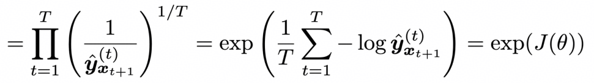

​	比较奇怪为什么这里的交叉熵并没有做“交叉”，而只是计算了信息量，一般意义上的交叉熵：
$$
H(P,Q)=-\sum_i p(x_i)log(q(x_i)) \label{1.2} \tag{1.2}
$$
​	式$\ref{1.1}$的计算结果越大，说明模型能力越差，这与交叉熵的性质是吻合的。

## 3 Recurrent Neural Networks (RNN)

### 3.1 模型结构

​	RNN采用了完全一致的权重来进行推理，每一次推理需要保存的只有中间隐藏层状态，如下图所示

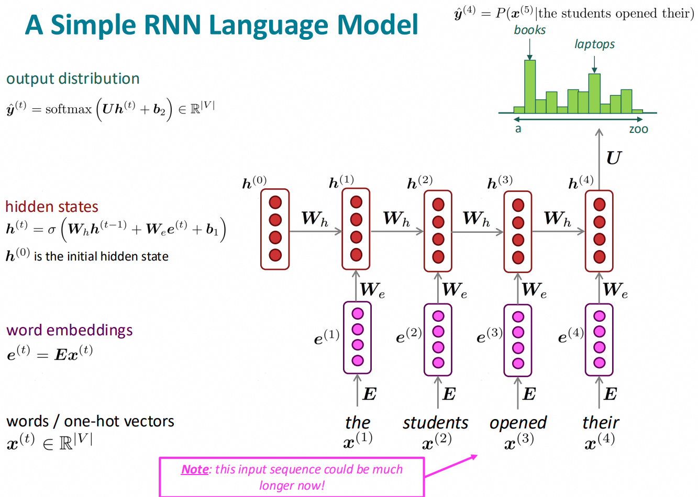

### 3.2 模型特点

​	RNN的优点主要是：

- 可以处理任意长度输入
- 可以通过隐藏层状态保留之前推理的信息
- 模型大小不随输入变化，因为W权重在推理时是不变的
- 采用不变权重，有对称性

​	而缺点主要是：

- 迭代计算在训练时会比较慢
- 随着推理步数增加，过往信息会被稀释

### 3.3 模型训练

#### 3.3.1 损失函数

​	RNN采用交叉熵损失函数来做训练，因为采用了one-hot的编码形式，所以交叉熵简化为了对数计算的形式：

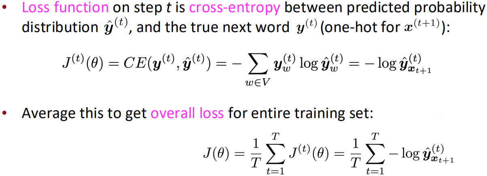

#### 3.3.2 teaching force

​	RNN采用"teaching force"方式进行训练，其核心概念是每个迭代步计算完损失函数后，都直接拿训练语料的下一个单词$y^{(t+1)}$当做输入喂给模型，而不是上一次模型预测计算的结果$\hat{y}^{(t)}$，这有助于将模型训练的稳定性及效率提升。

#### 3.3.3 反向传播

​	RNN也可以采用SGD类似的思想，每过一段语句，便进行梯度的更新，反馈到模型权重上，而不是整个语料库都做完之后才去计算交叉熵损失$J(\theta)$。一般来讲，为了训练效率，反向传播时要对传播的链长做截断（20步左右）。

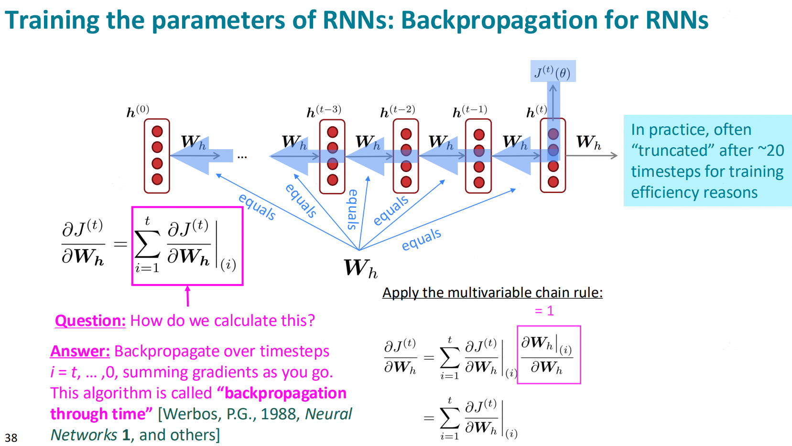

	#### 3.3.4 训练问题：梯度消失和梯度爆炸

##### 3.3.4.1 梯度消失

​	训练时由于求导的链式法则，假如导数存在一些极端小数时，乘在一起由于计算精度问题就会变为0。对于标量求导来说，这很容易理解，对于矩阵向量来说，可以通过特征值的方式来进行理解。

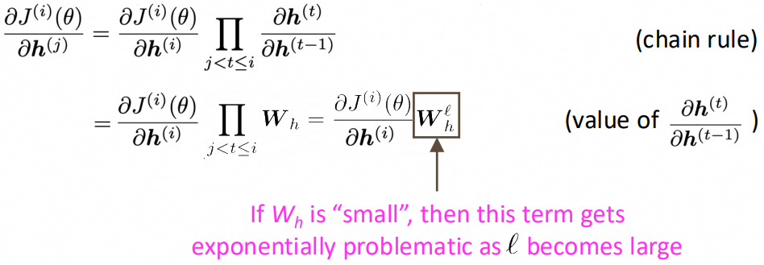

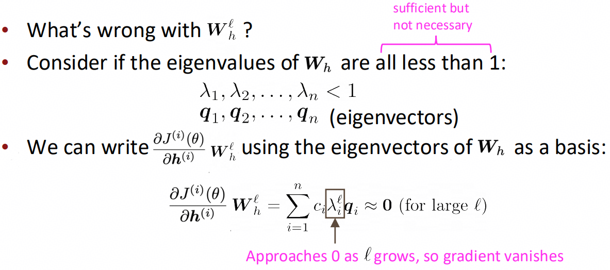

​	上述梯度消失会让信息的传递无法跨越长程，模型的权重被限制只能在小范围内更新，如此训练出的模型也无法进行长程依赖语句的推理预测。解决方案：有很多RNN的变种，LSTM、SSM等等，可以捕获长程依赖。

##### 3.3.4.2 梯度爆炸

​	与梯度消失类似，当求导链上的部分梯度极端大时，由于计算问题将会导致梯度爆炸，同样无法训练到长程依赖。

- 一方面过于大的梯度会让SGD更新步长变得非常大，出现损失震荡，训练可能永远也无法收敛
- 另一方面甚至可能会出现Inf或者NaN，训练崩溃

​	解决方法比较合乎直觉，直接让超出阈值的梯度进行缩放即可。梯度爆炸是比梯度消失更容易解决的问题。

## 4 LSTM

​	因为RNN训练的梯度消失问题，这里引出了长短期记忆模型：Long Short-Term Memory RNNs (LSTM)。核心idea主要是将长期和短期的记忆分开存储。

- 回顾上述第3节中的RNN特点，所有的过往信息被全部存放在隐藏层状态$h^{(t)}$中，对$h^{(t)}$的链式求导可以认为是在对过往记忆信息进行追溯，这造成了RNN在长期、短期的记忆建模方面过于简单，新的记忆不经任何特定规则的随着迭代直接写入$h^{(t)}$​中，旧的记忆被不断冲刷导致无法具备长程记忆。

### 4.1 模型特点

- LSTM选择单独把长期记忆存储在一个cell state中，类似于计算机内存的概念，cell state负责存放模型的长期记忆，而hidden state则存放短期的，即时信息。
- 长期记忆cell state通过3个门控来控制更新

### 4.2 模型结构

​	LSTM的模型架构如下图所示：

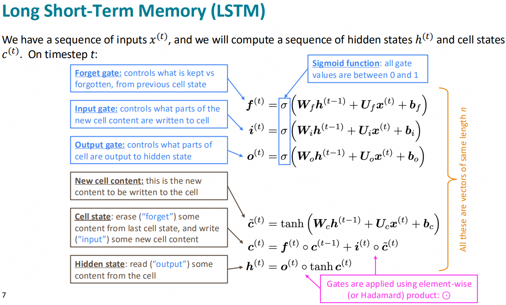

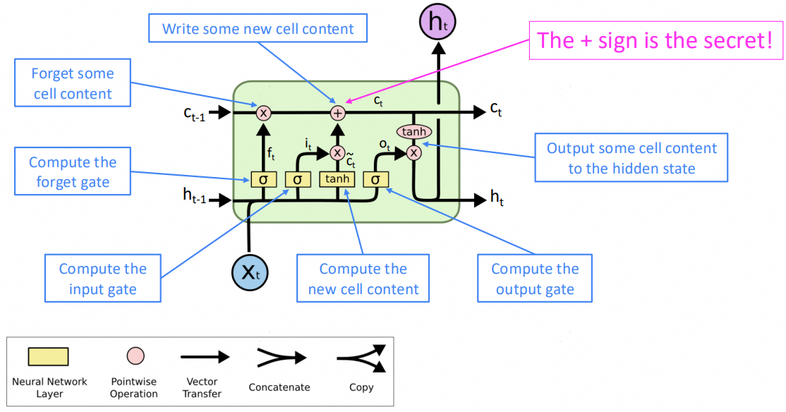

### 4.3 梯度消失的问题

​	需要申明的是：LSTM也不可以完全解决梯度消失的问题，这是由链式求导法则带来的直接影响。

#### 4.3.1 ResNet

​	ResNet(Residual connections)，也叫做skip-connections。核心idea就是将原本的输入$x^{(t)}$直接喂给输入，跳过中间的网络结构，这样做的好处在于可以让训练更加容易，避免梯度消失。

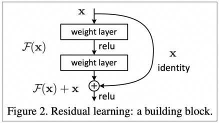

#### 4.3.2 DenseNet

​	DenseNet(Dense connections)，类似ResNet，DenseNet比ResNet更加稠密一点，每一层输入都要连接到后续网络层：

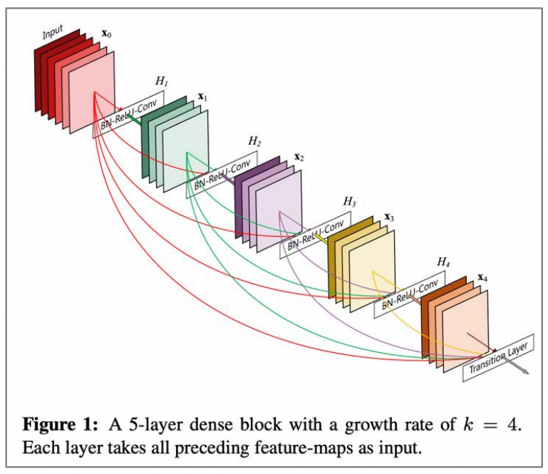

#### 4.3.3 HighwayNet

​	也类似于ResNet，只不过加了门控来限制输入$x^{(t)}$对跳过连接的权重

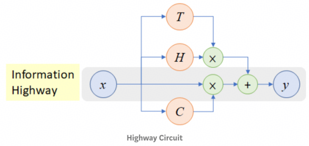

## 5 双向RNN

### 5.1 场景

​	情感分析中，一个单词的语义会被上下文影响，例如：“the movie was terribly exciting!”，不看上文或者下文，就无法判断terribly究竟是正向还是负向的情感表达。这时就需要双向RNN来完成任务。

### 5.2 模型结构

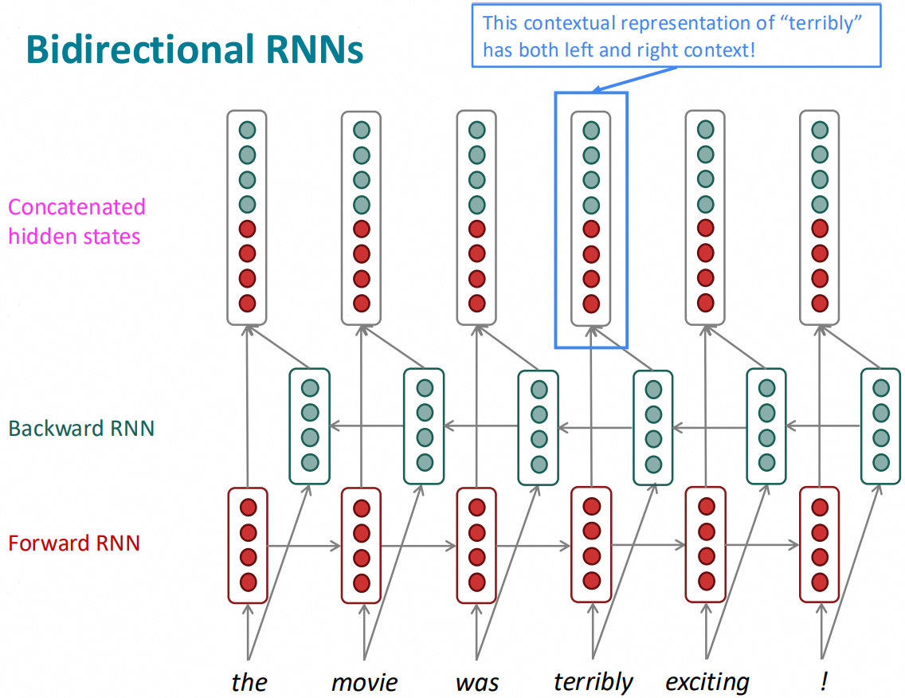

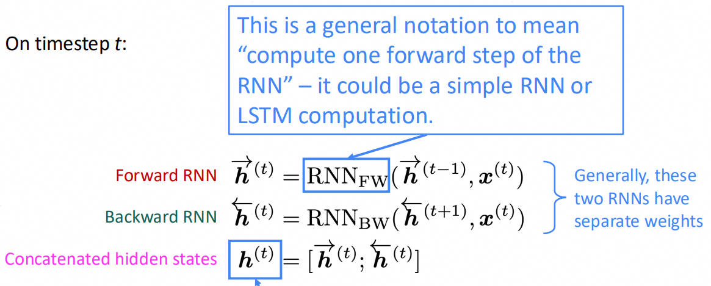

### 5.3 模型特点	

​	模型用来计算的隐藏层结构变成了双向计算的隐藏层状态的结合。当然，上述结构仅可以用在可以获取到全部输入语句时，这种场景下双向RNN也大概率优于传统RNN，因为可以从不同角度提取句子语义。

## 6 多层RNN

### 6.1 场景

​	主要是用于分析复杂的语言表达，并且比单层RNN表现要更好，一般的高性能RNN模型都采用了多层结构。

### 6.2 模型结构

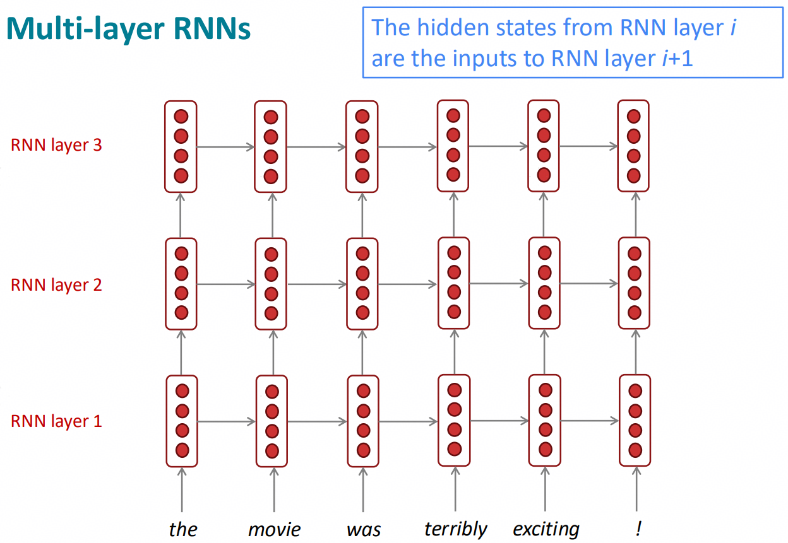

### 6.3 模型特点

​	一般堆叠的层数不会超过4层，超过4层后，更高的层数不会带来更多收益了；而transformer架构则可以堆叠更多层获取更高的模型表现。

## 7 seq2seq

​	seq2seq模型是一种条件语言模型：

- 语言模型：根据之前的提示词预测目标语句$y$的下一个词
- 条件：依赖于原语句$x$

### 7.1 场景

​	机器翻译、总结文本、对话、语句分析、代码生成等等

### 7.2 模型结构

### 7.3 训练方式

​	要想训练seq2seq模型：

- 简单方法需要一个大的平行语料库，分别对应这原语句$x$和目标语句$y$。
- 现在也发展出了”无监督NMT(Neural Machine Translation)“、数据增强等等方案，无需上述语料库

​	训练格式如下图，这里可以发现在Encoder中并不计算交叉熵损失，而是在Decoder中才去计算。下述结构也可以堆叠多层，不再赘述。

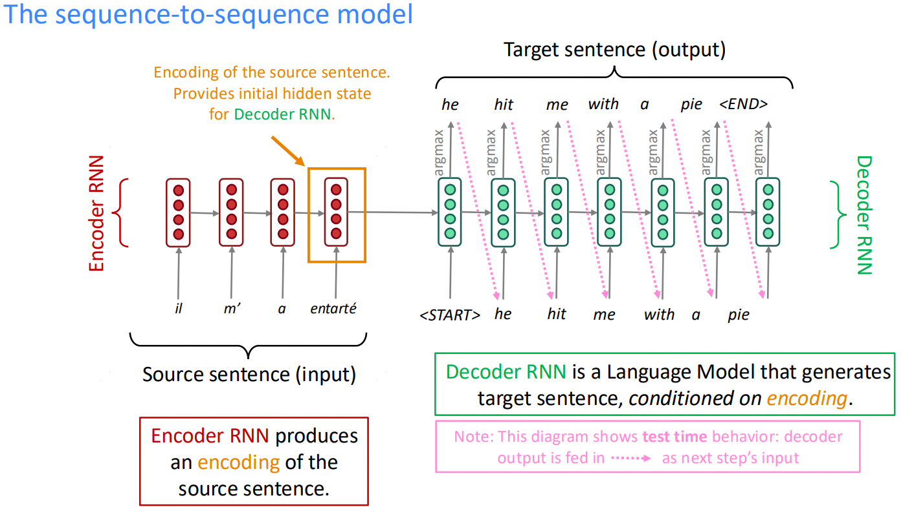

## 8 RNN瓶颈-Attention RNN

​	主要问题：

- 难以捕获长程依赖。
- 两点之间的相互作用是O(L)复杂度的，跟距离有关系，这不符合人理解语句的方式，效率也低。
- 并行度差，无法在大规模数据集上进行并行训练。

​	这里为了解决上述问题，引入了attention机制，核心idea就是加权平均。

### 8.1 模型结构

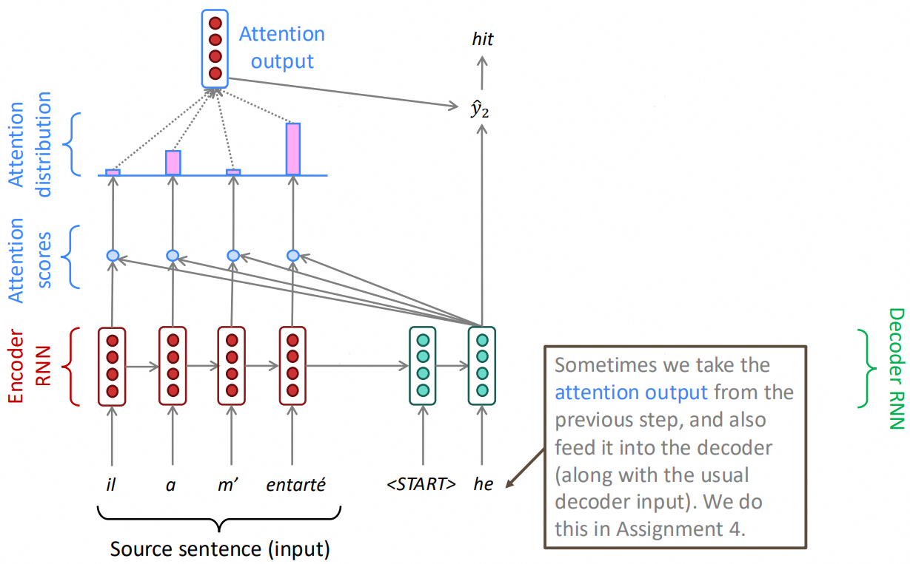

​	这里可以看到，Attention做的事情主要是对Encoder每一层隐藏层状态$h_i$在当前Decoder块的隐藏层状态$s_t$方向进行了投影，并最终加权求和，与$s_t$合并为一个向量并参与到下一次Decoder计算中。这可以有效地让模型关注到长程信息，**可以理解为attention在这里对跳过连接做了加权控制，是一种ResNet的变种。**

### 8.2 模型特点

​	Attention增强的RNN结构，本质上还是RNN，具备如下特点：

- 通过Attention来捕获长程依赖。
- 符合人类阅读习惯，Attention更像是查表而并非记忆。
- Attention并行性非常好，并且对模型表达能力提升明显。
- Attention的存在帮助解决了梯度消失的问题（与ResNet一样的跳过连接方式）。
- 有一定的可解释性，检查Attention中的投影信息或者Attention score，就可以发现推理时模型关注了哪些前置语句的信息。
- 计算复杂度提高，为了计算Attention，需要不断计算矩阵向量乘法（gemv）。

## 9 本节小结

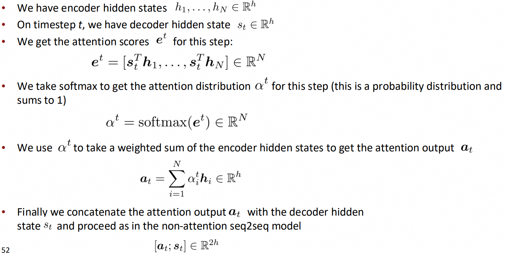