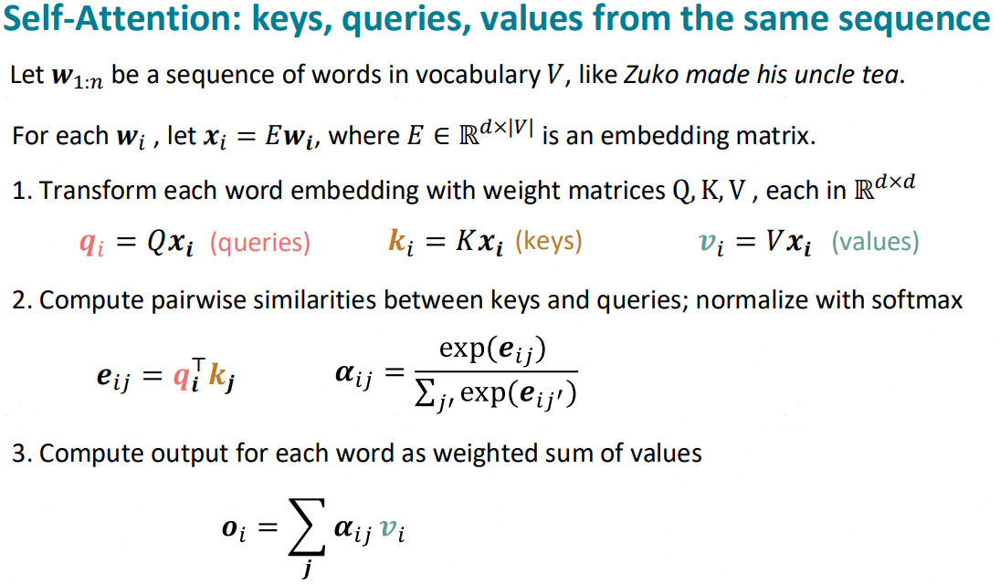
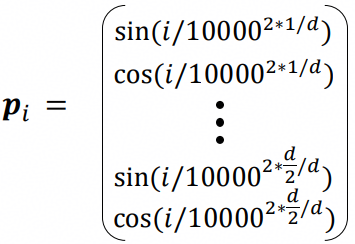
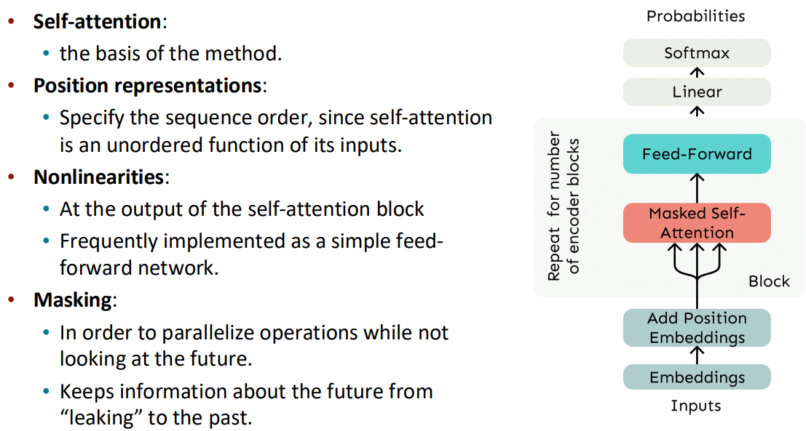
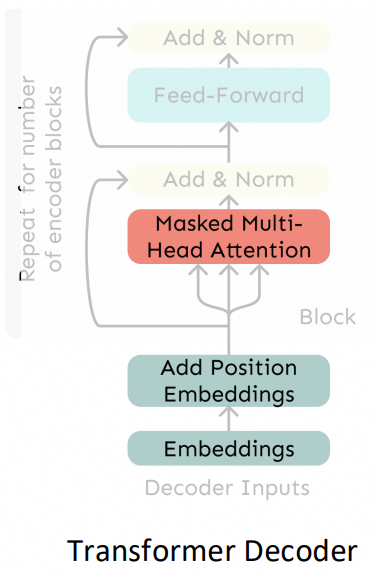
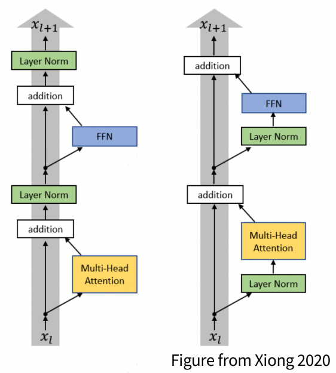

# week4: transformers

## 1 self attention

​	上周的课中说到，RNN可以有添加attention结构的变种，用以捕获长程依赖。而attention本身也具备RNN的全部功能，那这里引出一个问题：将RNN全部去掉，只留下attention是否可以工作的更好？

- RNN+attention的seq2seq模型中使用的attention是cross-attention，做的是Encoder和Decoder模块中隐藏层状态的向量内积。
- 对于生成式LM（language model）来说，直接采用self-attention可能工作的更好，也就是$y_t$与$y_i$进行内积计算。

### 1.1 模型结构

### 1.2 模型特点

- 上述模型无法感知语句顺序，因此需要添加位置编码：

| 位置编码形式   | 编码方法                                                     | 优点                                                         | 缺点                                               |
| -------------- | ------------------------------------------------------------ | ------------------------------------------------------------ | -------------------------------------------------- |
| 绝对位置编码   | $\tilde{x}_i=x_i+p_i$，直接在embedding向量$x_i$上添加初始输入$p_i$ | 计算简单，也可以直接concat起来而不是add                      | 效果可能一般                                       |
| 正弦位置编码   |  | 使用了周期编码，绝对位置可能并不重要。周期性可能带来较好的可扩展性。 | 不可学习，编码值与输入完全无关。扩展性也一般       |
| 可学习位置编码 | $p_i$全部设置为可学习参数                                    | 可学习，编码值与输入相关                                     | 不可扩展，每多一个位置，就要增加学习权重的尺寸维度 |
| RoPE           |                                                              | 相对位置编码，与绝对位置无关。是现在主流位置编码方法         |                                                    |

- 也没有非线性，因为模型结构的第三点公式只是对$v_i$进行加权累加，因此需要添加非线性层FFN：

$$
m_i = MLP(o_i) = W_2 * ReLU(W_1o_i + b_1) + b_2
$$

​	通过$ReLU$激活函数来添加非线性。

- 需要确保因果性，也即在进行下一个token预测时无法看到下一个token的真实值，因此需要做因果掩码

​	添加上述3点后，完整的自注意力block长这样：

> - 自注意力: self-attention
> - 位置编码: RoPE
> - 非线性: FFN
> - 因果掩码: casual mask

## 2 transformer

### 2.1 模型结构

​	这里将attention换成了多头注意力（MHA）。

​	单头注意力的缺点在于，$softmax(QK^T)$是在token维度做的归一化，随着序列长度增加，会逐渐变得难以捕捉局部信息。最直接的办法就是在token维度分段做$attention \;|\; softmax$​，这也就是MHA的思想。
$$
o_l = softmax(\frac {XQ_lK_l^TX^T} {\sqrt{d/h}}) * XV_l
$$
​	最终的输出就是$concat(o_l), l \in [0,h)$。

### 2.2 训练方法

#### 2.2.1 Residual connections

​	类似于ResNet，都是为了解决梯度消失问题，也就是上图中的"Add \& Norm"中的"Add"

#### 2.2.2 Layer normalization

​	在层的方向（一般就是隐藏层的feature方向）进行归一化，与之相对的还有batch norm（顾名思义就是在批次的方向进行归一化）。这种归一化有利于训练稳定。
$$
\begin{align}
o &= \frac {x-\mu} {\sqrt{\sigma} + \epsilon} * \gamma + \beta \\
\mu &= \sum_{j=1}^d x_j \\
\sigma &= \sqrt{\frac{1}{d}\sum_{j=1}^d(x_j - \mu)^2}
\end{align}
$$
​	其中$\gamma$和$\beta$是可以被训练的参数。

### 2.3 transformer block

​	一个block一般包括如下几个部分

- self-attention
- Add & Norm
- FFN
- Add & Norm

​	一般模型中可以由多个transformer block堆叠而成。

> Transformer Encoder block 和 Decoder block的唯一区别就是Encoder block没有因果掩码

### 2.4 Transformer Encoder-Decoder

​	transformer也可以组成上周所讲的seq2seq形式，在Encoder-Decoder中添加一个交叉注意力，如下图所示：

​	假设Encoder输出为$H=[h_1;...;h_n]$，Decoder输出为$Z=[z_1;...;z_n]$，那么cross-attention计算如下：
$$
o_{cross-attention}=softmax(ZQ(HK)^T)HV
$$
​	也就是，我们拿Decoder的隐藏层状态$Z$作为query，去查询其在Encoder中的相关情况，并作加权累加。

## 3 transformer架构缺点及变种

### 3.1 训练不稳定性（Pre vs Post norm）

​	现在绝大多数的语言模型都使用pre-norm，下图右：

### 3.2 平方复杂度（self-attention）

​	self-attention中$QK^T$的计算复杂度为$O(n^2d)$，其中$n$是token维度，代表序列长度，$d$是feature也就是特征维度。这样的平方复杂度决定了self-attention的计算成本较为高昂。尤其是相对于RNN、LSTM、SSM、Mamba等线性模型来说，平方复杂度显得不那么划算，但这仍然是目前的主流架构。