# week5: pretraining

## 1 pretaining

### 1.1 核心观点

- 让模型可以训练更大尺度、更多样的数据集
- 不使用标注数据集，否则无法进行scaling
- 计算感知scaling

### 1.2 子词建模

大意就是训练时可以采用**Byte-pair encoding**的方式来进行子词建模，主要分为如下几个步骤：

- 从只包含字符和词尾结束符的词表开始训练
- 使用文本语料，找到最经常连接在一起的字符，并组成一个子词(**subword**)，例如"a"和"b"组成"ab"
- 不断替换字符对为新的子词，直到获得我们想要的词表大小

上述办法最一开始用于机器翻译，现在发展出的一种相似方法（WordPiece）被广泛用于预训练中。

### 1.3 pretrained word embeddings

这是之前的预训练方式，仅对词嵌入进行预训练，这时的预训练不获取词与词之间的上下文关系，仅仅只是对embedding做预训练，其他部分的权重都是随机初始化的。

### 1.4 pretraining whole models

这是现在的预训练方式，对几乎整个模型进行预训练，大部分权重在正式训练之前的权重都不是随机初始化的。优点主要是：

- 加速训练过程：训练的初始参数不再是随机初始化的
- 提高性能：学习通用特征
- 解决数据不足问题：因为不需要标签数据，可以引入大规模数据集
- 迁移学习：预训练的大规模数据集通用特征提取较好，可以拿预训练的数据对新的场景或者任务再做训练，迁移能力较强
- 提高泛化能力：大规模数据集提取的通用特征，有助于避免模型在训练集上的过拟合

> 试想一下，从大规模数据集预训练得到的参数，本就可能是一个较优的权重$\hat{\theta}$，这时再用$\hat{\theta}$来通过任一种（例如SGD）优化器进行训练，寻找到的局部极小值可能也具备$\hat{\theta}$的一些特性，例如泛化性等等。

### 1.5 预训练方法

主要是有3中预训练类型：
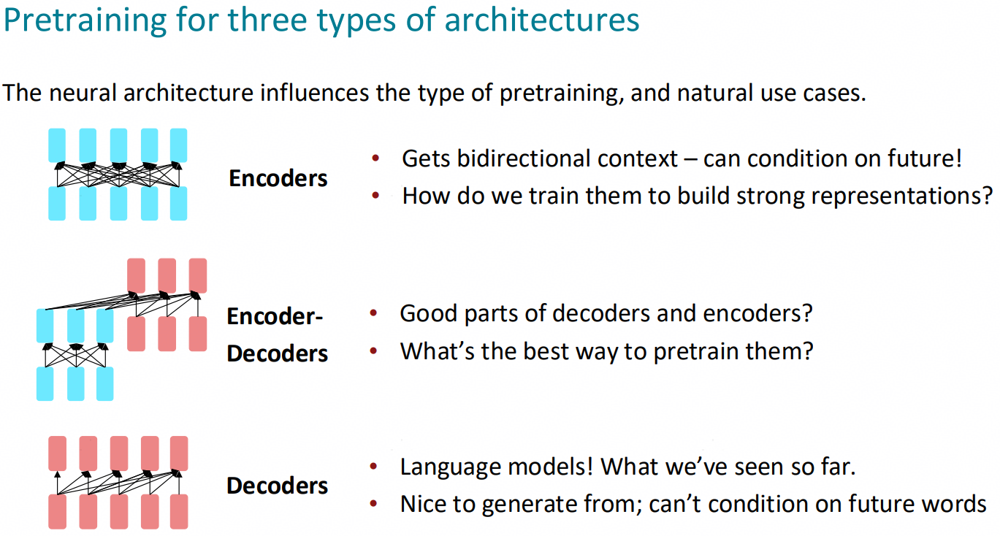

#### 1.5.1 Pretraining encoders

encoder可以看到完整地上下文信息，因此不能单独拿来做自回归生成式语言模型，但可以用来做masked LM，也就是“完形填空”。比较经典的就是BERT(Bidirectional Encoder Representations from Transformers) Masked LM。BERT的预训练成本非常高昂，但是微调的成本却比较低。这可以让BERT一次预训练，在不同的任务中多次微调。也有很多BERT微调的扩展模型，例如：RoBERTa、SpanBERT等等。

#### 1.5.2 Pretraining encoder-decoders

encoder主要用于从双向上下文获取信息，decoder主要负责实现语言模型的功能。T5(Text-To-Text Transfer Transformer)模型就是一种encoder-decoders预训练模型，他的创新之处在于将各种NLP任务统一表示为文本到文本任务：

- 对于分类任务，输入的是文本，输出是类别的文本表示。
- 对于翻译任务，输入是源语言的文本，输出是目标语言的文本。
- 对于问答任务，输入是问题和上下文，输出是答案文本。

T5模型采用一种叫**Span Corruption**(填空任务)的任务来进行预训练，并采用**encoder-decoders transformer**结构来做预训练，论文数据证明这样效果比**language modeling**、**decoder transformer**更加好。

#### 1.5.3 Pretraining decoders

decoder可以用**language modeling**来做训练，代表性的就是**GPT**(Generative Pretrained Transformer)，这种大型预训练模型似乎并不需要进行梯度更新就可以从输入语料中学习到部分规律，例如可以输入部分规则，让模型根据规则来进行回答等等。

### 1.6 scaling laws

- scaling有助于降低模型困惑度
- scaling有助于识别模型规模与数据之间的trade-off
- scaling可以帮助我们做出模型架构的取舍

一般来说，模型的规模(parameters)与训练模型所需的数据量(tokens)在一个量级，且呈正相关，但也不绝对，例如Chinchilla使用了70 Billion参数规模，却使用1.4 Trillion tokens来做训练。

## 2 post-training

### 2.1 finetuning
为什么需要**finetuning**，其实是因为经海量数据预训练后的模型无法满足user的多种任务需求。finetuning和pretraining都可以采用问答方式来进行训练。

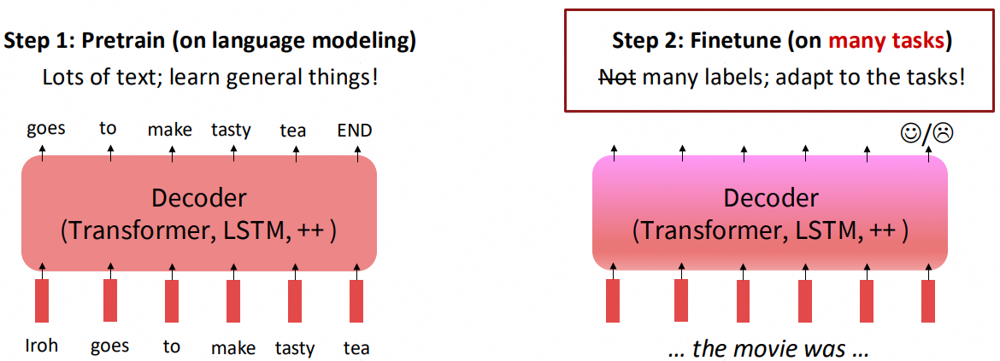

#### 2.1.2 multi-task benchmark
现在也有很多大型benchmark，例如MMLU(Massive Multitask Language
Understanding)、BIG-Bench等等，可以用来评估模型微调的能力。他们都包含多种不同类型的任务，可以从不同方面对模型做有效评估。

#### 2.1.3 Instruction finetuning
**指令微调**：在带有指令提示和相应输出的标记数据集上微调大模型的技术，通过提供一组概述所需操作的指南或指令，使预训练模型适应执行特定任务。

例如：
- 指令：“你是一个乐于助人、尊重他人且诚实的助手。始终尽可能有帮助地回答，同时确保安全。你的回答不应包含任何有害、不道德、种族主义、性别歧视、恶毒、危险或非法的内容。请确保你的回答在社会上不带有偏见，并且具有积极的性质。如果一个问题没有意义，或事实不连贯，请解释原因，而不是回答错误的内容。如果你不知道问题的答案，请不要分享错误信息。”
- 上下文：<<输入你的上下文>>
- 问题：<<输入你的问题>>
- 输出：<<针对问题的示例输出>>

指令微调之前模型可能无法正确回答问题：

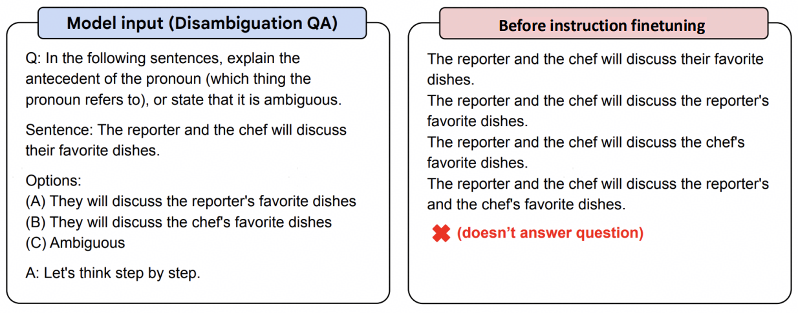

微调之后，可以正确回答：

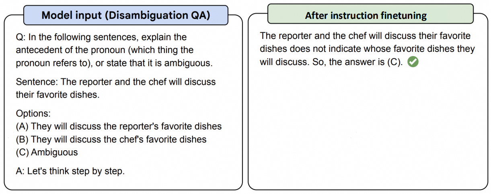

### 2.2 Reinforcement learning from human feedbacks (RLHF)
#### 2.2.1 场景
指令微调后，部分任务可能仍然无法满足用户需求，例如有些问题的答案可能本身就是开放性的，没有正确之分。为了满足用户喜好，这时就需要RLHF：

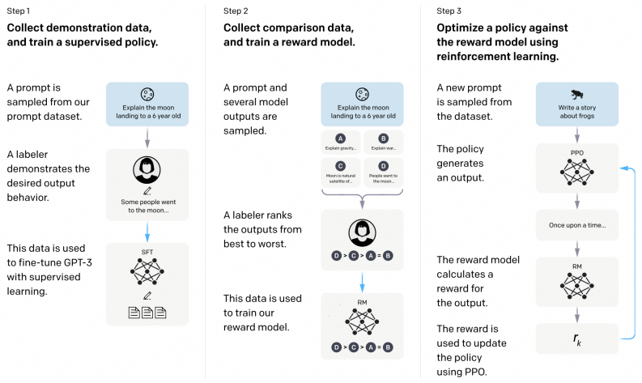

#### 2.2.2 强化学习简单原理
这里非常简要的过了一下强化学习的原理，假设现在有一个Reward数据集，包含了所有人类偏好的回答方式，Reward的数据越大越好。那么我们期望最终达成的目标就是最大化LLM回答的Reward：

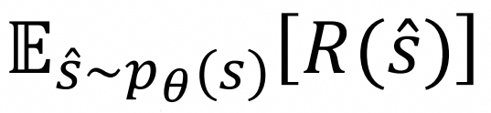

那么参数更新的方式可以以梯度下降为例：

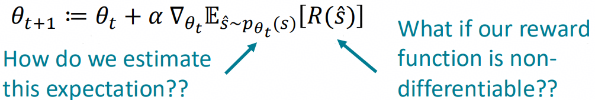

其中梯度可以挪到期望的内部：

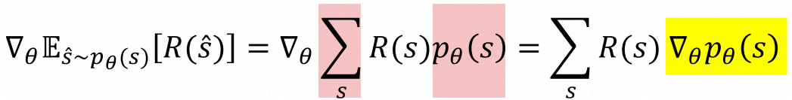

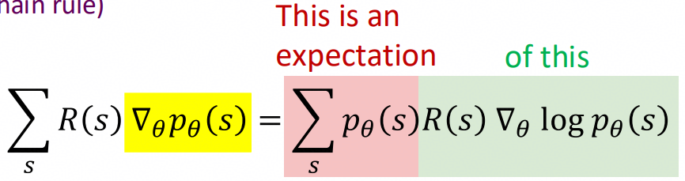

最终经过蒙特卡洛采样期望可以约等于离散数据的采样：

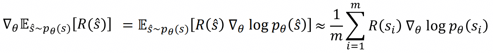

那么$\theta$的更新方式就变为了：

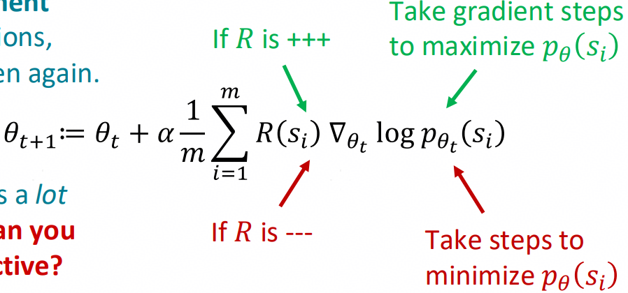

这样梯度的计算就与$R(s)$函数彻底解耦了，只有参数的更新需要求导。

#### 2.2.3 训练方式

上述方式带来了几个问题：

- 人工标注成本较高：可以单独训练一个模型$RM_{\phi}(s)$来做这件事情
- 人工标注可能存在很多噪声和校准错误：不直接问评分多少，而是从几个评分中进行比较选择。

最终RLHF的训练方式如下：

- 获取预训练模型$p^{PT}(s)$，通过大量数据集训练得到，泛化性较好但特化性不足
- 获取奖励模型$RM_{\phi}(s)$，通过人类评分比较数据集训练得到
- 以参数$p_{\theta}^{RL}(s)$初始化模型
- 开始训练并通过如下方式进行更新：
$$
    R(s) = RM_{\phi}(s) - \beta log(\frac{p_{\theta}^{RL}(s)}{p^{PT}(s)}) \label{2.1} \tag{2.1}
$$

其中KL散度被定义为如下公式，作为防止RLHF训练参数偏移预训练参数过多而添加的惩罚项。
$$
    log(\frac{p_{\theta}^{RL}(s)}{p^{PT}(s)}) \label{2.2} \tag{2.2}
$$
可以看出，当$p_{\theta}^{RL}(s)$和$p^{PT}(s)$越是接近，或者完全一致时，惩罚项将越趋近于0。

### 2.3 RL + Reward Modeling 限制

- 用户偏好以及基于用户偏好训出的RM是不可靠的：有时模型会为了提供看起来权威或者有帮助的回答，与事实真相相去甚远，产生幻觉。这是一种所谓的"Reward Hacking"(奖励黑客)，指RL中模型利用奖励函数的一些歧义或者捷径来获得高奖励单并未真正对任务和数据集进行学习。

### 2.4 Direct Preference Optimization(DPO)

DPO的idea主要是想绕过奖励模型RM，直接从偏好数据获取优化策略，主要基于以下理论推导：

1. 假设初始情况下我们follow RLHF的期望最大化原则：
$$
    E_{\hat{y} \sim p_{\theta}^{RL}(\hat y | x)}[RM_{\phi}(x,\hat y) - \beta log (\frac{p_{\theta}^{RL}(\hat y | x)}{p^{PT}(\hat y | x)})] \label{2.3} \tag{2.3}
$$
2. 而在Bradley-Terry模型下，我们认为人类偏好可以由下述loss来描述：
$$
    J_{DPO}(\theta) = -E_{(x,y_w,y_l)\sim D}[log\sigma(RM_{\theta}(x,y_w)-RM_{\theta}(x,y_l))] \label{2.4} \tag{2.4}
$$
其中，$y_w$表示"win"，$RM_{\theta}(x,y_w)$为正，越大表示正反馈越大；$y_l$表示"loss"，$RM_{\theta}(x,y_l)$为负，越小表示负反馈越大。
3. 我们假设奖励函数可以由下述方式表示，因为它更符合式$\eqref{2.3}$的表达形式，并且$Z(x)$也可以满足奖励函数的任意形式。
$$
RM_{\theta}(x,\hat y)=\beta log (\frac{p_{\theta}^{RL}(\hat y | x)}{p^{PT}(\hat y | x)}) + Z(x) \label{2.5} \tag{2.5}
$$
4. 那么Bradley-Terry模型下，loss最终可以描述为下述形式：
$$
    J_{DPO}(\theta) = -E_{(x,y_w,y_l)\sim D}[log\sigma( \beta log \frac{p_{\theta}^{RL}(y_w|x)}{p^{PT}(y_w|x)} - \beta log \frac{p_{\theta}^{RL}(y_l|x)}{p^{PT}(y_l|x)})] \label{2.6} \tag{2.6}
$$
    - 可以看到，与$y_w$和$y_l$均无关的$Z(x)$被我们约掉了，这是Bradley-Terry模型下最大的一个假设。
    - 式$eqref{2.6}$的表达形式说明Bradley-Terry模型下loss的计算完全不依赖于Reward模型，而仅与参数$p$有关。它描述了"winning sample"和"losing sample"在RL(强化学习模型)与PT(预训练模型)参数存在gap时对损失的贡献情况。随着RL的进行，损失函数$J_{DPO}(\theta)$逐步趋近于0。

下图展示了RLHF和DPO的流程区别，开源大模型现在几乎全部使用了DPO而不是RLHF。
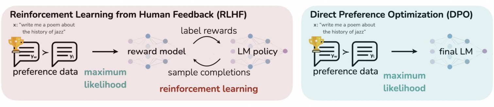

### 2.5 人类偏好数据来源

- 海外廉价劳动力
- AI反馈？

### 2.6 总结
| 维度 | Prompt Engineering（提示工程） | Instruction Tuning（指令微调） | RLHF（Reinforcement Learning from Human Feedback） | DPO（Direct Preference Optimization） |
|------|-------------------------------|-------------------------------|--------------------------------------------------|--------------------------------------|
| **核心思想** | 通过精心设计输入提示（prompt）引导模型生成期望输出，不修改模型参数。 | 在预训练模型基础上，使用带指令-响应对的数据进行有监督微调（SFT），使模型学会遵循指令。 | 利用人类对模型输出的偏好标注，通过强化学习优化策略，使模型输出更符合人类偏好。 | 将偏好数据直接用于监督式训练，绕过显式的奖励建模和强化学习，直接优化策略。 |
| **是否修改模型参数** | ❌ 否 | ✅ 是 | ✅ 是 | ✅ 是 |
| **训练阶段** | 推理阶段（无需训练） | 微调阶段（有监督训练） | 两阶段： 1. SFT（可选） 2. 奖励模型训练 + PPO 强化学习 | 单阶段：直接在偏好数据上优化策略 |
| **所需数据类型** | 无（仅需设计 prompt） | 指令-响应对（如 “写一首诗” → “……”） | 人类偏好对（如 response A ≻ response B） | 人类偏好对（同 RLHF） |
| **是否需要人类标注** | ❌ 否（但依赖人工设计） | ✅ 是（需高质量指令-答案对） | ✅ 是（需大量偏好比较） | ✅ 是（需偏好对） |
| **计算开销** | 极低 | 中等（标准微调） | 高（需训练奖励模型 + PPO 训练，不稳定） | 低（单次监督训练，稳定高效） |
| **主要优点** | - 快速迭代 - 无需训练 - 灵活适应不同任务 | - 提升指令遵循能力 - 效果显著且稳定 - 可作为 RLHF 的基础 | - 能对齐复杂人类偏好（如安全性、有用性） - 曾是主流对齐方法 | - 避免 RL 不稳定性 - 训练更简单高效 - 性能媲美甚至超越 RLHF |
| **主要缺点** | - 效果依赖 prompt 设计技巧 - 泛化能力有限 - 对复杂任务效果差 | - 无法直接优化“偏好”（只能模仿示例） - 需大量高质量标注数据 | - 训练流程复杂 - PPO 收敛困难 - 计算资源消耗大 | - 理论假设较强（如 Bradley-Terry 偏好模型） - 对数据质量敏感 |
| **典型应用场景** | 快速原型验证、零样本/少样本推理、API 调用 | 通用助手微调（如 Alpaca、WizardLM） | 高质量对话系统（如 InstructGPT、Claude、早期 ChatGPT） | 新一代开源模型对齐（如 Zephyr、LLaMA-3-DPO） |
| **代表工作/模型** | Chain-of-Thought, Self-Consistency | FLAN, T0, Alpaca | InstructGPT (OpenAI), Claude (Anthropic) | DPO 论文 (Rafailov et al., 2023), Zephyr-7B, LLaMA-3 |