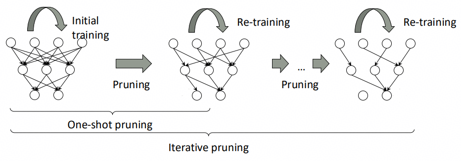
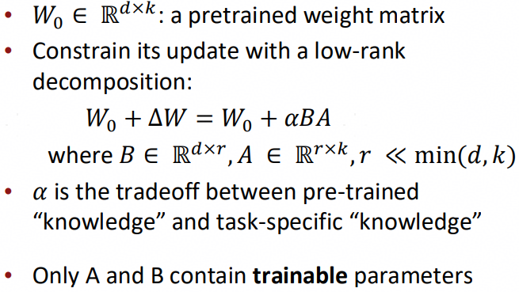
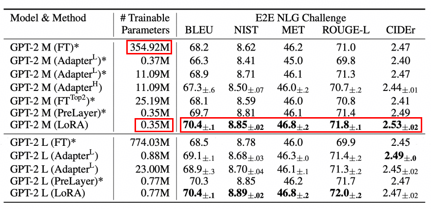
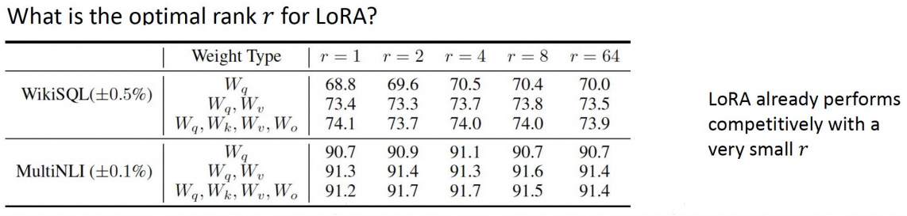
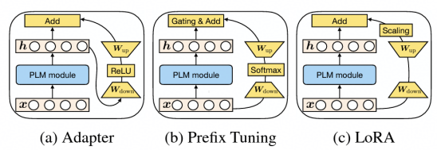
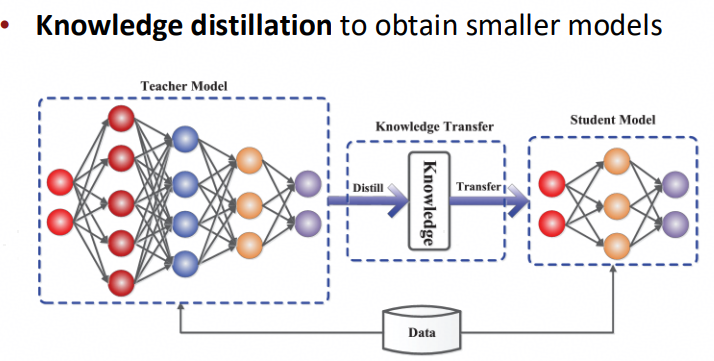

# week6: Efficient Adaptation (Prompting + PEFT)

## 1 Prompting+PEFT

### 1.1 few-shot learning

前面主要介绍了一下大模型的涌现能力，随着模型越来越大，GPT1.0->GPT3.0，大模型开始具备few-shot learning(少样本学习)能力。模型可以通过用户提供的少量样本对规律进行学习，而无需更新模型权重，例如：

这里横轴是所谓的"shot"个数，纵轴是模型performance，在0点(也就是zero-shot)到1点(one-shot)时存在较为明显的阶跃，之后逐渐平缓。

### 1.2 Prompting

区别与传统的fine-tuning(微调)，few-shot Prompting并不需要进行权重的更新。

- Prompting的效果有时要依赖于prompt本身的编写方式，效果不好时更换更加容易理解的prompt可能会取得不错的提升。
- 除了直接给模型提供模板输出的prompt方式，也可以提供**Chain-of-Thought(CoT) Prompting**，也就是思维链提示词。可以帮助模型更好地理解问题给出正确的回答。

> CoT Prompting也可以做zero-shot

基于prompt的学习有很多缺点：
- 效率低下，每次模型推理时都需要去处理prompt
- 模型性能差，一般来说prompt比fine-tuning的效果差
- 对于prompt提示词较为敏感，甚至对于样例的输入顺序也比较敏感
- 模型从prompt中学习到的东西不够明确

### 1.3 parameter efficient fine-tuning (PEFT)

**fine-tuning**和**parameter efficient fine-tuning**的区别在于更新权重的规模，**fine-tuning**会在微调时几乎更新所有模型权重，而**parameter efficient fine-tuning**则只会更新一小部分：

**PEFT**的优点在于：
- 不需要全量更新所有参数，效率更高，更省钱
- 现今SOTA模型，大部分都存在参数过量的问题，只调部分关键参数不会带来性能损耗
- 全量参数SFT(监督微调)有副作用，会对参数进行密集更新，可能破坏与训练知识，导致泛化能力下降

PEFT方法的核心idea就是：**模型网络是稀疏的**，那么就有两种思路：
- 仅更新部分关键权重，对模型做剪枝，仅对剪枝完毕的稀疏子网络进行更新。可以参考这篇文章：https://zhuanlan.zhihu.com/p/1932393310833612574
- 低秩更新，也就是LoRA

### 1.4 Sparse subnetworks (稀疏子网络)

常见的稀疏化方法就是剪枝，剪枝的关键指标就是权重的量级大小，在模型剪枝时，会阶段性移除某一部分小量级权重(例如通过添加binary mask的方式)，如此剪枝多轮，最终达到PEFT训练目标：

剪枝一般可以如下分类：
#### 1.4.1 按剪枝粒度(Granularity)

| 类型 | 描述 | 特点 |
|------|------|------|
| **非结构化剪枝(Unstructured Pruning)** | 逐个剪掉单个权重(如将某些权重设为0) | 压缩率高，但需要稀疏计算支持；普通硬件难以加速 |
| **结构化剪枝(Structured Pruning)** | 剪掉整行/列、通道(filter)、神经元、甚至整个层 | 可直接在标准 CPU/GPU 上加速，兼容性好；压缩率通常较低 |

#### 1.4.2 按剪枝时机(When to prune)

| 类型 | 描述 |
|------|------|
| **训练中剪枝** | 在模型训练过程中动态进行剪枝 |
| **训练后剪枝** | 先训练完整模型，再进行剪枝(通常需微调) |
| **一次性剪枝** | 一次性剪掉目标比例的参数 |
| **迭代剪枝** | 多轮“剪枝 + 微调”逐步达到目标压缩率(效果通常更好) |

#### 1.4.3 常用剪枝方法

| 方法 | 描述 | 优点 | 缺点 |
|------|------|------|------|
| **基于权重大小(Magnitude-based)** | 根据权重绝对值(如 L1 范数)判断重要性，剪掉最小的权重 | 实现简单、高效；广泛使用 | 忽略参数间的相互作用，可能误剪重要连接 |
| **基于梯度/敏感度(Sensitivity-based)** | 利用损失函数对参数的敏感度(如一阶或二阶梯度)评估重要性 代表方法：OBD(Optimal Brain Damage)、OBS(Optimal Brain Surgeon) | 理论基础强，考虑模型局部曲率 | 计算 Hessian 矩阵开销大，难以扩展到大模型 |
| **基于重要性评分(Importance Score)** | 使用自定义指标评估参数重要性，例如 `∂L/∂w × w`(泰勒展开一阶项) | 比单纯看权重更合理，兼顾梯度与幅值 | 仍为静态评估，未考虑训练动态 |
| **自动化/学习式剪枝(Learning-based)** | 引入可学习掩码(mask)或门控机制，在训练中自动决定保留哪些结构 代表方法：SNIP、GraSP、RigL、AutoPruner、彩票假设(Lottery Ticket Hypothesis) | 可端到端优化，适应性强 | 实现复杂，训练成本高 |
| **Movement Pruning** | 在训练过程中，不仅看权重当前大小，更关注其**更新方向(梯度符号)**： 若权重在训练中持续向零“移动”(即梯度与权重符号相反)，则视为可剪 由 Google 提出，适用于 BERT 等大模型微调场景 | 能识别“正在变得不重要”的参数，比静态 magnitude 更动态有效 支持非结构化和结构化变体 | 需在训练中跟踪权重变化，仅适用于训练中剪枝；实现略复杂 |

### 1.5 low rank adaptation (LoRA)

核心idea就是认为**预训练模型的权重更新在微调过程中具有低秩特性**，假设full fine-tuning的更新权重为$\Delta W$ (通常非常大)，那么由于$\Delta W$是低秩矩阵，对应更新过程可以压缩为：

LoRA训练时：
- 原始权重$W_0 \in \mathbb{R}^{d \times k}$被**冻结**(不参与训练)
- 新增两个低秩矩阵$B$和$A$，**仅训练这两个小矩阵**
- 前向传播时实际使用：$h = W_0 x + \Delta W x = W_0 x + \alpha BAx$

LoRA的优点如下：
| 优势 | 说明 |
|------|------|
| **参数效率高** | 仅需训练 0.1%~1% 的原始参数量(例如：7B 模型只需新增 ~4M 参数) |
| **无推理延迟** | 微调完成后可将$W + \alpha BA$合并回原权重，推理时**零额外开销** |
| **可插拔** | 多个 LoRA 适配器可共享同一基础模型，按需切换(适合多任务/多用户场景) |
| **兼容性强** | 可与量化、剪枝等其他压缩技术结合使用 |
| **避免灾难性遗忘** | 冻结原始权重，保留预训练知识 |

下图可以看到LoRA的参数更新量是很少的(相对FT来说)，并且E2E NLG Challenge分数表现更高，这也是现在的主流方法，经常用于transformer self-attention模块。

LoRA中低秩矩阵的秩可以低到什么程度呢？答案是即使在r=1时，也可以保持较好性能：

这充分说明full fine-tuning的更新权重$\Delta W$是非常非常稀疏的。这里还介绍了一种LoRA的变种**QLoRA**，就是在LoRA的基础上加了量化，不再展开。

### 1.6 An input perspective of adaptation

这里主要指的是从输入角度来对模型进行tuning。介绍了两种方法：
- Prefix-Tuning：在模型参数添加前缀并冻结预训练模型权重，只训练这部分前缀。
- Prompt-Tuning：在模型输入前添加一个**virtual tokens**作为prompt，只训练这部分**virtual tokens**的embedding。

#### 1.6.1 Prefix-Tuning

**Prefix-Tuning**的核心idea是冻结全部预训练参数，并在模型处理输入前添加可训练的参数(prefix parameters)。优点是可以对当前run的batch内的所有推理序列运行不同的**Prefix-Tuning**参数。

#### 1.6.2 Prompt-Tuning

这里注意**Prompt-Tuning**与上文的**Prompting**不是一回事。区别如下：
| 特性 | **Prompting(In-context Learning)** | **Prompt-Tuning** |
|------|--------------------------------------|-------------------|
| **是否需要训练** | ❌ 不需要，直接推理 | ✅ 需要训练(仅训练 prompt 向量) |
| **Prompt 形式** | 离散文本(人类可读，如 `"Q: ... A: ..."`) | 连续向量(soft prompt，不可读，随机初始化) |
| **参数更新** | 模型完全冻结，无任何参数更新 | 模型主干冻结，仅更新 prompt 的 embedding 向量 |
| **典型场景** | GPT-3/4 的 zero-shot / few-shot 推理 | 微调 T5、BART、LLaMA 等 encoder-decoder 或 decoder-only 模型 |
| **灵活性** | 依赖模型已有知识，无法适应新任务分布 | 可通过训练让模型适配特定下游任务 |
| **性能表现** | 在超大模型(如 GPT-4)上效果好，小模型上弱 | 即使在中等规模模型(如 T5-base)上也能有效提升性能 |
| **代表工作** | GPT-3 (Brown et al., 2020) | Prompt Tuning (Lester et al., 2021) |

### 1.7 A functional perspective of adaptation

这是通过在模型上添加一个额外的增量函数来实现adaptation，一般称这个增量函数为**adapters**，它其实就是一个简单的FFN网络：
$$
    f_{\phi}(x)=W^U(\sigma(W^Dx))
$$
只不过，**adapters**是一种“**轻量级、旁路式、用于微调的FFN**”，而不是用来替代transformer中原有的FFN模块。

- **adapters**可以在比**fine-tuning**少训练2个量级参数的前提下达到几乎一致的模型性能表现。
- **adapters**也可以用来做语言方面的适配，例如使用美式英语预料预训练的模型可以通过**adapters**来适配到英式英语。

之前介绍的LoRA、prefix tuning、adapters都可以通过函数形式表示：

> https://openreview.net/pdf?id=0RDcd5Axok

### 1.8 Other variants of (efficient) adaptation

简单介绍了一下知识蒸馏：

## 2 Benchmarking and Evaluation

这里略过详细介绍，仅记录takeways：

1. 封闭式任务(Closed-ended tasks)
    - 需思考评估什么：如任务多样性(diversity)、任务难度(difficulty)等维度。
    - 要关注外部效度(external validity)——即评估结果是否能推广到真实场景。
2. 开放式任务(Open-ended tasks)
    - 可使用内容重叠指标(content overlap metrics)，尤其在输出多样性较低的场景中有用。例如N-gram overlap metrics，对于机器翻译、文献总结、对话、故事生成等等足够开放、多样性的任务，上述指标很难去进行评估。
    - 可使用语义重叠指标(Semantic overlap metrics)，比content会更加宽泛一些。
    - 可使用基于模型的指标(Model-based metrics)，直接使用embedding向量来进行比较，例如计算向量间的余弦相似度、散度等等。这种评估方法也不完全可靠。
    - 无参考评估方法(reference-free measures)正在进步，但仍不可靠，需谨慎使用。
    - 人类评估(Human evaluation)，是黄金标准，但是成本高昂并且效率很低。也有基于人类反馈训练的专门的评估模型。不过也会受到评估模型质量的影响，不完全可靠。
    - 对话系统评估(Chatbot evals)，极其困难，是当前研究中的开放问题。关键难点在于如何选择合适的评估样本和评估方式。
3. 主要挑战
    - 一致性问题：很难确定我们是否在评估真正重要的方面。
    - 数据污染(contamination)：训练/测试数据可能泄露，导致评估结果不可信。
4. 人工判断仍至关重要
    - 务必亲自查看模型生成的输出，不要只依赖自动指标。
    - 建议公开发布大量系统生成样本，以增强透明度和可复现性。