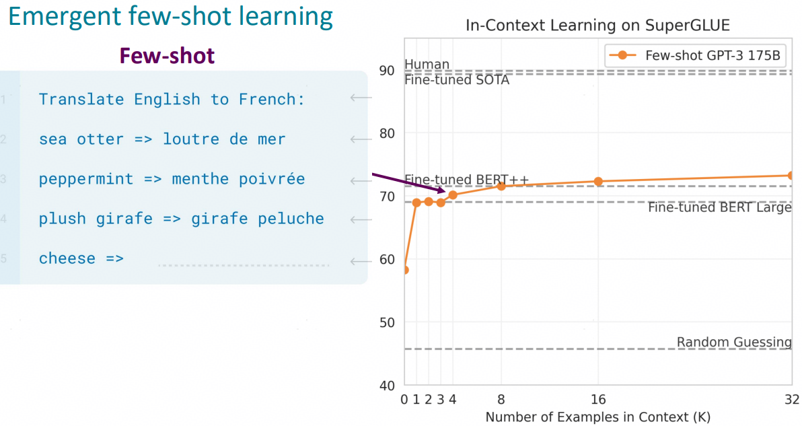
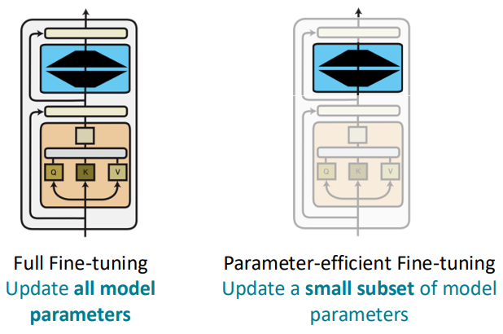

# week6: Efficient Adaptation (Prompting + PEFT)

## 1 Prompting

### 1.1 few-shot learning

前面主要介绍了一下大模型的涌现能力，随着模型越来越大，GPT1.0->GPT3.0，大模型开始具备few-shot learning(少样本学习)能力。模型可以通过用户提供的少量样本对规律进行学习，而无需更新模型权重，例如：

这里横轴是所谓的"shot"个数，纵轴是模型performance，在0点（也就是zero-shot）到1点（one-shot）时存在较为明显的阶跃，之后逐渐平缓。

### 1.2 Prompting

区别与传统的fine-tuning(微调)，few-shot Prompting并不需要进行权重的更新。

- Prompting的效果有时要依赖于prompt本身的编写方式，效果不好时更换更加容易理解的prompt可能会取得不错的提升。
- 除了直接给模型提供模板输出的prompt方式，也可以提供**Chain-of-Thought(CoT) Prompting**，也就是思维链提示词。可以帮助模型更好地理解问题给出正确的回答。

> CoT Prompting也可以做zero-shot

基于prompt的学习有很多缺点：
- 效率低下，每次模型推理时都需要去处理prompt
- 模型性能差，一般来说prompt比fine-tuning的效果差
- 对于prompt提示词较为敏感，甚至对于样例的输入顺序也比较敏感
- 模型从prompt中学习到的东西不够明确

### 1.3 parameter efficient fine-tuning (PEFT)

**fine-tuning**和**parameter efficient fine-tuning**的区别在于更新权重的规模，**fine-tuning**会在微调时几乎更新所有模型权重，而**parameter efficient fine-tuning**则只会更新一小部分：

**PEFT**的优点在于：
- 不需要全量更新所有参数，效率更高
- 现今SOTA模型，大部分都存在参数过量的问题，只调部分关键参数不会带来性能损耗
