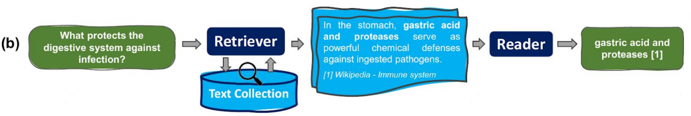
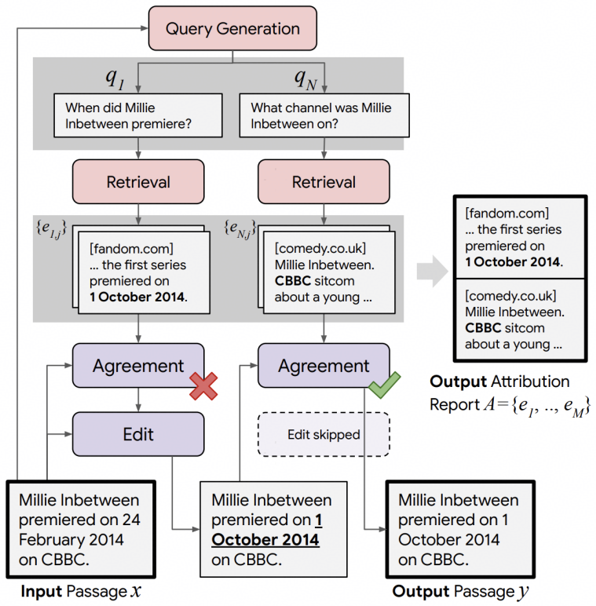

# week7+9: QA + Model Analysis and Interpretability

## 1 QA

Question Answering，两种类型：

- Closed book：闭卷回答，不能查资料，模型知识全部来源于参数权重
- Open book：开卷回答，可以查资料，阅读理解，或者是RAG等等

### 1.1 Closed book
#### 1.1.1 parametric knowledge

模型的参数具备很强的知识储备，很多LLM benchmark也会做纯知识储备方面的测试评估。那么模型的参数是如何获取到知识的呢？答案是scaling。稀疏性和架构不变的前提下，越大的模型知识储备越强。

- 隐含知识仍然很难被模型学习到：CoT(思维链)是一种解决办法，例如之前提到的CoT Prompting
- 逆转诅咒(Reversal curse)会限制模型在知识方面的应用：例如模型已知女性A的儿子是B，在被询问B的母亲是谁是可能并不能很好的回答。

#### 1.1.2 Hallucinations (模型幻觉)

模型可能会对不知道的事情胡乱作答。所以更需要对不知道或者评估得到可信度较低的陈述进行克制或者弃权(abstention)，也可以通过对模型幻觉较为严重的领域新增知识继续训练(continued pretraining)以缓解问题。

**黑盒LLM**+**Closed book**始终会存在诸多问题：
- 参数可以储存大量知识但是无法记住所有内容
- 时代与知识都在随事件发展，而模型更新需要重新或者增量训练
- 无法获取某些指定的私人文档内的知识
- 很难验证回答是否正确

### 1.2 Open book
#### 1.2.1 Reading comprehension (阅读理解)

阅读理解在很多实际场景中都非常有用，也是评估计算机系统理解人类语言能力的重要测试方法，许多NLP任务都可以拆解成阅读理解问题。

#### 1.2.2 Retrieval augmentation (检索增强)

例如从wikipedia中检索文档，克服LLM的诸多问题，例如模型幻觉、知识更新等等，也有助于增强模型回答的可解释性，因为LLM可以将回答引用进行标注(尽管这本身也会有幻觉问题)，由人类来检验是否正确。

这通常需要一个检索器(Retriever)来做信息检索和一个阅读器(Reader)来做阅读理解。检索增强生成(RAG)是现在用的很多的方法。

##### 1.2.2.1 retrievers (检索器)

- Word-overlap retrieval: 可以计算词重叠来检索
- Vector retrieval: 可以计算embedding向量相似度来检索
- LM retrieval: 可以使用语言模型来检索
- 可训练retrievers: 通过训练的方式来构建retrievers，当然reader也可以训练
- 有时检索更多的文档并不一定会对结果的准确性有帮助，这说明模型并不能处理很多文件输入。

LLM+web search也是一个应用场景，流程如下图所示：

